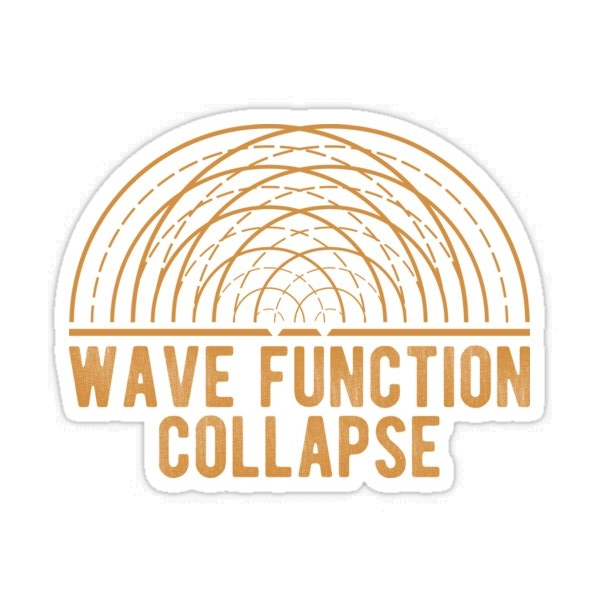

</a>

## The Ingredients and Tools with which my [**`Laboratory🎮`**](https://github.com/JH-Games) operates !
### You can also check my [**`Persoanl Profile👨‍💻`**](https://github.com/Joknaa).

  

 

 

<!-- ------------------------------------------------------------------------------------------------------------------------------------------------------------------------------ --> 

## ⚒️ Some of the tools i use :

 

 

 
 

<!-- ------------------------------------------------------------------------------------------------------------------------------------------------------------------------------ --> 

    

### Show some ❤️ by following and starring some repositories!

  

  
